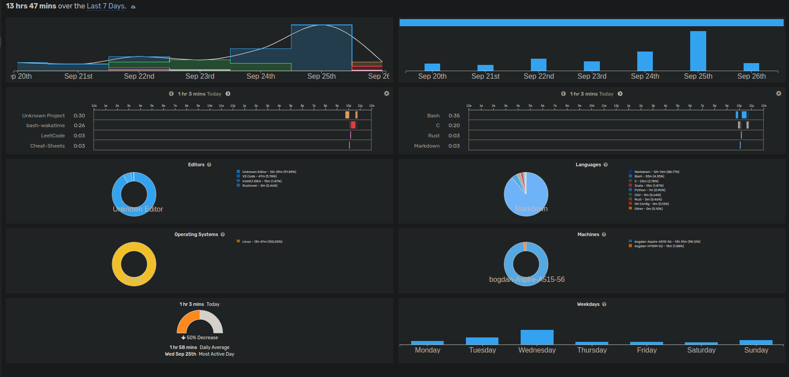

# My `VS Code` Setup
---

## `VS Code` Extension
---

I personally prefer the following VS Code **extentions**:

- For Viewing Data:
  - Edit csv

    

  - Rainbow CSV

    

  - CSV to Markdown Table

    

  - Excel Viewer

    

  - JSON Crack

    

- For MarkDown Files:
  - Markdown All in One

    

  - Markdown Link Updater

    

  - Markdown PDF

    

  - Markdown Preview Enhanced

    

  - HTTP/s and relative linker checker

    

  - view-readme

    

  - CSV to Markdown Table

    

- For PDFs:
  - pdf

    

  - PDF Viewer

    

  - vscode-pdf

    

  - Markdown PDF

    

- Color Themes:
  - Blue Black (Blackest With Blue)

    

  - Black Ocean

    

  - Iceberg Theme (by cocopon)

    

  - Iceberg (by harg)

    

  - GitHub Theme

    

  - Nord

    

  - Electron Color Theme

    

  - The Digital Life

    

- Code Related:
  - WakaTime

    

  - Error Lens

    

  - TODO Highlight

    

  - Todo Tree

    

  - In Your Face

    

  - Live Server

    

  - Path Intellisense

    

  - Postman

    

- Others:
  - fzf fuzzy quick open

    

  - WSL

    

  - Bash Beatify

    

## `WakaTime`
---

> `WakaTime` is a `VS Code` extension.

Dashboard Results:

To see the dashboard results, click on the `WakaTime` button in `VS Code`
(buttom line, left side).

Or, access this link: <https://wakatime.com/dashboard>.

To get the `API key`:
- 1\. Create an account on <https://wakatime.com>,
- 2\. Go to dashboard (<https://wakatime.com/dashboard>),
- 3\. Click on the upper-right profile picture
- 4\. Settings
- 5\. Account
- 6\. Secret API Key

